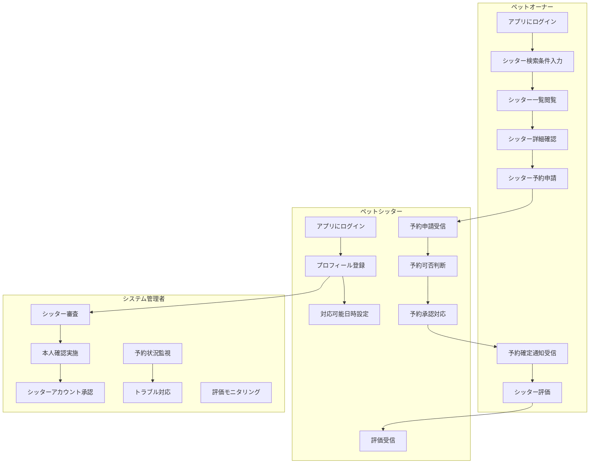

```mermaid

graph TD
    subgraph ペットオーナー
        A1[アプリにログイン] --> A2[シッター検索条件入力]
        A2 --> A3[シッター一覧閲覧]
        A3 --> A4[シッター詳細確認]
        A4 --> A5[シッター予約申請]
        A8[予約確定通知受信] --> A9[シッター評価]
    end

    subgraph ペットシッター
        B1[アプリにログイン] --> B2[プロフィール登録]
        B2 --> B3[対応可能日時設定]
        B4[予約申請受信] --> B5[予約可否判断]
        B5 --> B6[予約承認対応]
        B7[評価受信] 
    end

    subgraph システム管理者
        C1[シッター審査] --> C2[本人確認実施]
        C2 --> C3[シッターアカウント承認]
        C4[予約状況監視] --> C5[トラブル対応]
        C6[評価モニタリング]
    end

    A5 --> B4
    B6 --> A8
    A9 --> B7
    B2 --> C1
    
```