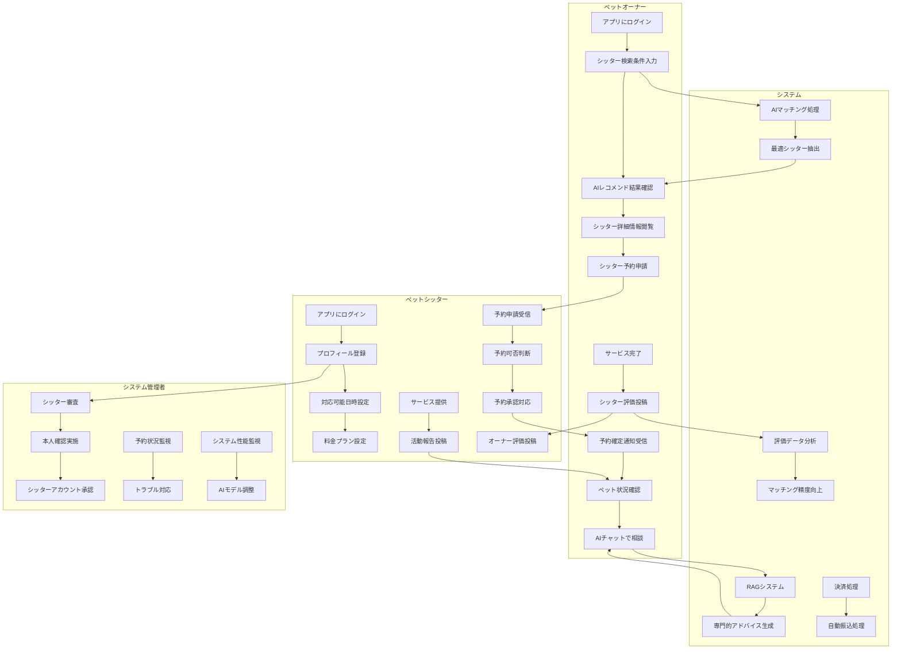

```mermaid

graph TD
    subgraph ペットオーナー
        A1[アプリにログイン] --> A2[シッター検索条件入力]
        A2 --> A3[AIレコメンド結果確認]
        A3 --> A4[シッター詳細情報閲覧]
        A4 --> A5[シッター予約申請]
        A8[予約確定通知受信] --> A9[ペット状況確認]
        A9 --> A10[AIチャットで相談]
        A11[サービス完了] --> A12[シッター評価投稿]
    end

    subgraph ペットシッター
        B1[アプリにログイン] --> B2[プロフィール登録]
        B2 --> B3[対応可能日時設定]
        B3 --> B4[料金プラン設定]
        B5[予約申請受信] --> B6[予約可否判断]
        B6 --> B7[予約承認対応]
        B8[サービス提供] --> B9[活動報告投稿]
        B10[オーナー評価投稿]
    end

    subgraph システム
        C1[AIマッチング処理] --> C2[最適シッター抽出]
        C3[RAGシステム] --> C4[専門的アドバイス生成]
        C5[決済処理] --> C6[自動振込処理]
        C7[評価データ分析] --> C8[マッチング精度向上]
    end

    subgraph システム管理者
        D1[シッター審査] --> D2[本人確認実施]
        D2 --> D3[シッターアカウント承認]
        D4[予約状況監視] --> D5[トラブル対応]
        D6[システム性能監視] --> D7[AIモデル調整]
    end

    A2 --> C1
    C2 --> A3
    A5 --> B5
    B7 --> A8
    A10 --> C3
    C4 --> A10
    B9 --> A9
    A12 --> B10
    B2 --> D1
    A12 --> C7

```